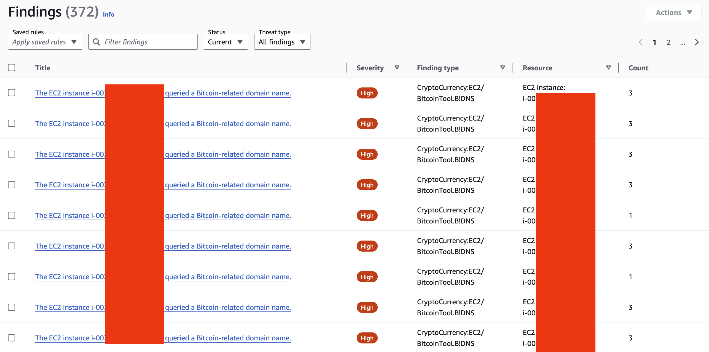

`01_guardduty_crypto_mining_test.sh`

This commit introduces a script that simulates cryptocurrency mining activities
to test AWS GuardDuty's detection capabilities. The script performs several
simulations including:

- Mining pool DNS queries
- Network traffic to known mining servers and ports
- Stratum protocol message patterns
- Mining software download attempts
- CPU usage patterns similar to mining operations
